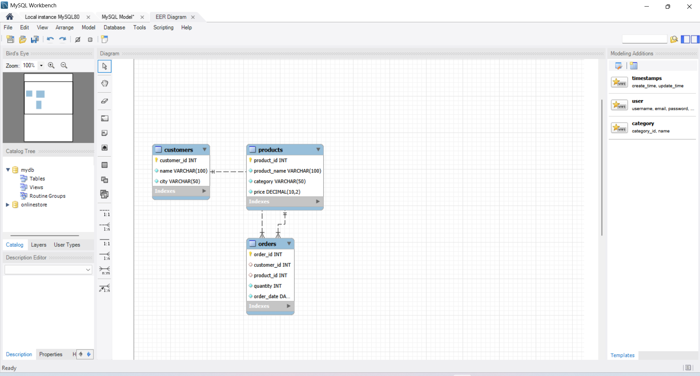
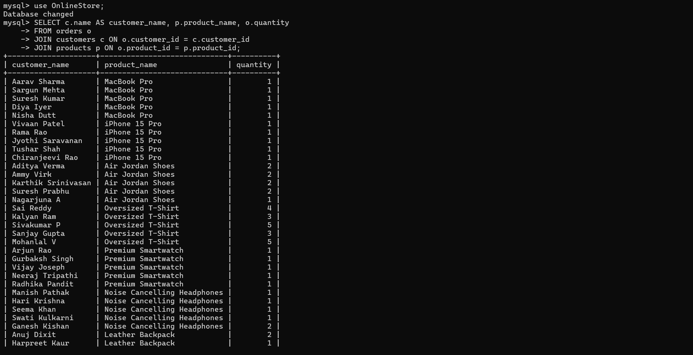
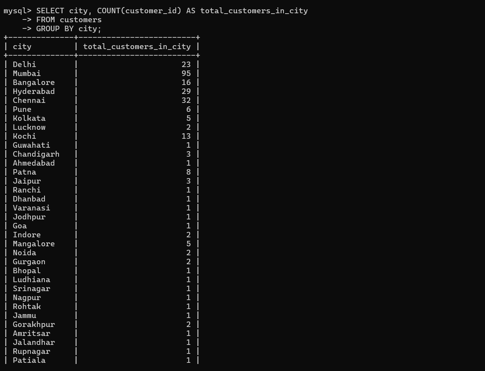
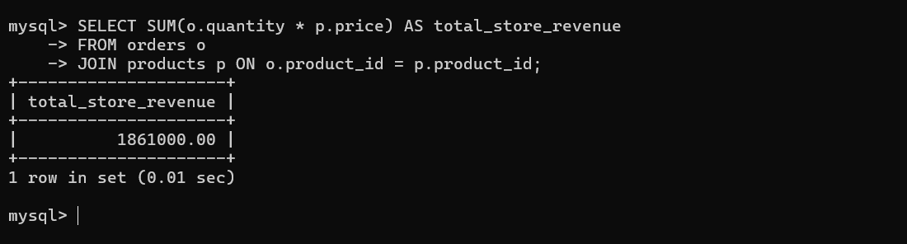
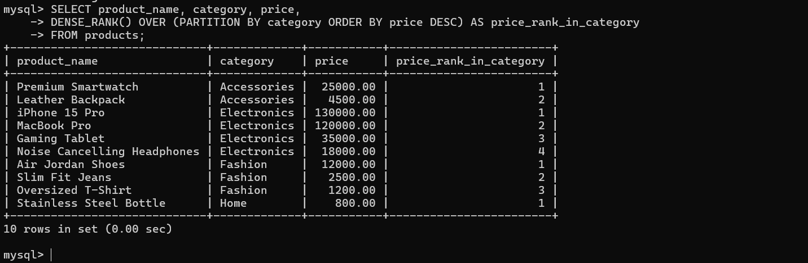
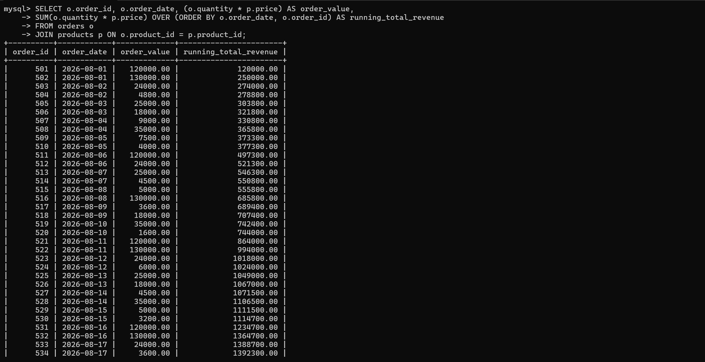

# 🛒 Online Store Database System — SQL Data Analytics Project

A MySQL-based **Online Store Database System** designed to manage customer, product, and order data and perform business-oriented analysis using SQL.

---

## 📌 About the Project

The **Online Store Database System** is a relational database project built using **MySQL**.

The project manages data related to:

* 👥 Customers
* 🛍️ Products
* 📦 Orders

It contains **300 customer records, 10 products, and 50 order records** and uses SQL queries to analyze sales, customers, products, and revenue.

The project demonstrates practical SQL concepts including **JOINs, aggregate functions, GROUP BY, filtering, window functions, ranking, and running total calculations**.

---

## 🎯 Project Objectives

* Design a structured relational database for an online store.
* Store and manage customer, product, and order information.
* Establish relationships using Primary Keys and Foreign Keys.
* Retrieve data using multi-table JOINs.
* Perform sales analysis using aggregate functions.
* Analyze customer distribution by city.
* Calculate total store revenue.
* Rank products within their categories based on price.
* Calculate cumulative revenue over time using Window Functions.
* Generate business-oriented insights from relational data.

---

## 🗄️ Database Structure

The database is named:

```sql
OnlineStore
```

The project contains three main tables:

### 1. Customers

Stores customer information.

| Column        | Description        |
| ------------- | ------------------ |
| `customer_id` | Unique customer ID |
| `name`        | Customer name      |
| `city`        | Customer city      |

**Primary Key:** `customer_id`

---

### 2. Products

Stores product information.

| Column         | Description       |
| -------------- | ----------------- |
| `product_id`   | Unique product ID |
| `product_name` | Product name      |
| `category`     | Product category  |
| `price`        | Product price     |

**Primary Key:** `product_id`

---

### 3. Orders

Stores order information.

| Column        | Description                   |
| ------------- | ----------------------------- |
| `order_id`    | Unique order ID               |
| `customer_id` | Customer who placed the order |
| `product_id`  | Product ordered               |
| `quantity`    | Quantity ordered              |
| `order_date`  | Date of order                 |

**Primary Key:** `order_id`

**Foreign Keys:**

* `customer_id` → `customers.customer_id`
* `product_id` → `products.product_id`

### 🔗 Table Relationship

```text
Customers
    │
    │ customer_id
    ▼
 Orders
    ▲
    │ product_id
    │
Products
```

### 🖥️ Database Structure



---

## 📊 Dataset Overview

| Dataset   | Records |
| --------- | ------: |
| Customers |     300 |
| Products  |      10 |
| Orders    |      50 |

### Product Categories

The products belong to categories including:

* Electronics
* Fashion
* Accessories
* Home

### Order Period

The order data covers:

**August 1, 2026 – August 25, 2026**

---

## 💼 Business Questions Solved

This project uses SQL to answer questions such as:

1. Which customers have placed orders?
2. What products have customers ordered?
3. How many orders are present in the database?
4. What are the highest and lowest product prices?
5. What is the average price of Electronics products?
6. How many customers belong to each city?
7. What is the total revenue generated by the store?
8. How can products from selected categories be filtered?
9. How can products be ranked within each category based on price?
10. How can cumulative revenue be calculated for orders over time?

---

## 🧠 SQL Concepts Used

### Database & Relational Concepts

* Database Creation
* Table Creation
* Primary Keys
* Foreign Keys
* Relationships between tables

### SQL Query Concepts

* `SELECT`
* `WHERE`
* `JOIN`
* `GROUP BY`
* `IN`
* `INSERT`

### Aggregate Functions

* `COUNT()`
* `SUM()`
* `AVG()`
* `MIN()`
* `MAX()`

### Window Functions

* `DENSE_RANK()`
* `SUM() OVER()`
* `PARTITION BY`
* `ORDER BY` within Window Functions

---

## 🔍 Key Analysis Performed

### 1. Customer Order Analysis

A JOIN between the `customers` and `orders` tables is used to identify customers who placed orders and their order dates.

```sql
SELECT c.name, o.order_date
FROM customers c
JOIN orders o
ON c.customer_id = o.customer_id;
```

---

### 2. Customer Product Analysis

A three-table JOIN is used to display the customer name, product name, and quantity ordered.

```sql
SELECT c.name, p.product_name, o.quantity
FROM orders o
JOIN customers c
ON o.customer_id = c.customer_id
JOIN products p
ON o.product_id = p.product_id;
```

### 📊 Customer & Product Analysis Result



---

### 3. Total Number of Orders

```sql
SELECT COUNT(order_id) AS total_orders
FROM orders;
```

**Result:** 50 orders

---

### 4. Highest and Lowest Product Prices

```sql
SELECT MAX(price) AS highest_price,
       MIN(price) AS lowest_price
FROM products;
```

**Results:**

* Highest Product Price: **₹1,30,000**
* Lowest Product Price: **₹800**

---

### 5. Average Electronics Product Price

```sql
SELECT AVG(price) AS avg_electronics_price
FROM products
WHERE category = 'Electronics';
```

**Result:** **₹75,750**

---

### 6. Customer Distribution by City

```sql
SELECT city, COUNT(customer_id) AS total_customers
FROM customers
GROUP BY city;
```

This analysis shows the number of customers associated with each city.

### 🌆 Customer Distribution Result



---

### 7. Total Store Revenue

Revenue is calculated using:

**Quantity × Product Price**

```sql
SELECT SUM(o.quantity * p.price) AS total_revenue
FROM orders o
JOIN products p
ON o.product_id = p.product_id;
```

**Total Revenue: ₹18,61,000**

**Approximately: ₹18.61 lakh**

### 💰 Revenue Analysis Result



---

### 8. Category-Based Product Filtering

```sql
SELECT *
FROM products
WHERE category IN ('Fashion', 'Accessories');
```

This query filters products belonging to the **Fashion** or **Accessories** categories.

---

## 📈 Advanced SQL Analysis — Window Functions

### 9. Rank Products Within Each Category

The `DENSE_RANK()` Window Function is used to rank products within each category based on their price in descending order.

```sql
SELECT product_name,
       category,
       price,
       DENSE_RANK() OVER (
           PARTITION BY category
           ORDER BY price DESC
       ) AS price_rank_in_category
FROM products;
```

### Concepts Demonstrated

* `DENSE_RANK()`
* `PARTITION BY`
* `ORDER BY`
* Category-wise ranking

This allows products to be ranked **separately within each category** according to their price.

### 🏆 Product Ranking Result



---

### 10. Running Total / Cumulative Revenue

A Window Function is used to calculate the cumulative revenue generated by orders over time.

```sql
SELECT o.order_id,
       o.order_date,
       (o.quantity * p.price) AS order_value,
       SUM(o.quantity * p.price)
       OVER (
           ORDER BY o.order_date, o.order_id
       ) AS running_total_revenue
FROM orders o
JOIN products p
ON o.product_id = p.product_id;
```

### Concepts Demonstrated

* `SUM() OVER()`
* Running total
* Cumulative revenue
* `ORDER BY`
* Multi-table JOIN

The query calculates the revenue of each order and maintains a **running cumulative revenue total** according to order date and order ID.

### 📈 Running Total Revenue Result



---

## 📊 Key Findings

Based on the current dataset:

| Metric                    |         Result |
| ------------------------- | -------------: |
| Total Customers           |            300 |
| Total Products            |             10 |
| Total Orders              |             50 |
| Highest Product Price     |      ₹1,30,000 |
| Lowest Product Price      |           ₹800 |
| Average Electronics Price |        ₹75,750 |
| Total Store Revenue       |     ₹18,61,000 |
| Order Data Period         | Aug 1–25, 2026 |

---

## 🛠️ Technologies Used

* **MySQL**
* **SQL**
* **MySQL Workbench** 

---

## 📁 Repository Structure

```text
Online-Store-Database-System/
│
├── Online_Store_Database.sql
└── README.md
```

---

## ▶️ How to Run

### Step 1: Install MySQL

Install **MySQL Server** and optionally **MySQL Workbench**.

### Step 2: Open the SQL File

Open:

```text
Online_Store_Database.sql
```

in MySQL Workbench or another MySQL-compatible SQL environment.

### Step 3: Execute the Database Section

Run the database and table creation statements first.

This will:

* Create the `OnlineStore` database
* Create the `customers` table
* Create the `products` table
* Create the `orders` table

### Step 4: Insert the Data

Execute the `INSERT` statements to populate the tables with customer, product, and order data.

### Step 5: Run the Analysis Queries

Execute the analysis queries to generate:

* Customer order information
* Product and customer analysis
* Order count
* Price analysis
* Customer distribution
* Total revenue
* Category filtering
* Product ranking
* Running cumulative revenue

---

## 💡 Skills Demonstrated

This project demonstrates practical knowledge of:

* SQL Query Writing
* MySQL
* Relational Database Concepts
* Primary & Foreign Keys
* Multi-table JOINs
* Data Filtering
* Data Aggregation
* GROUP BY
* Window Functions
* Product Ranking
* Running Total Calculation
* Revenue Analysis
* Customer Data Analysis
* Business-Oriented Data Analysis

---

## 🙋‍♂️ About Me

I am a **BCA graduate and aspiring Data Analyst** with an interest in **SQL, Excel, Python, and Data Analytics**.

This project helped me strengthen my understanding of **relational databases, SQL query writing, JOINs, data aggregation, Window Functions, and sales analysis** by working with customer, product, and order data.

I am continuously building hands-on projects to improve my technical and analytical skills and prepare for an entry-level **Data Analyst** role.

📫 Feel free to connect with me on LinkedIn!
